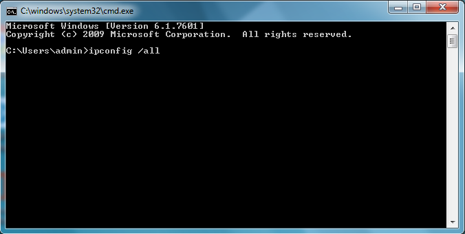

# Internet Access

Updated: 2016-11-02

In order to get internet access you need to complete the following steps:

1. Submit your MAC address to the IT department.
2. Request a user account for the filter login and set your password.
3. Log in to the filter. (You will need to do this every time you come
   in for the day.)

## MAC Address

You may not have a Mac, but every network interface has a MAC (Media
Access Control) address. Instructions for how to find this MAC address
are listed below. To identify the interface you want to use go ahead
and plug in an ethernet cable or connect to the `OuachitaHills` wireless
access point.

### Windows

On Windows press the Windows key and r at the same time. This will bring
up a prompt where you will type in `cmd` and hit enter.

Next type in `ipconfig /all` as shown here:

Next look for a section that has `10.11.12.*` in it where * means any number.
In that section you should see `Physical Address`. Write down the letters and
numbers after the colon (:) as shown here:

### OS X

First we want to open System Preferences, you may do so by clicking on the apple
as shown below:

You will want to then click on `System Preferences` which will bring up this window:

Next we want to click on Network which should bring up this:

You then want to click on `Advanced` for the interface you are trying to get the MAC
address of which should bring you to another page where you need to click `Hardware`
and that should bring you here:

You want to write down the number after `MAC Address`.

### Linux

The most consistent way to find the MAC address in Linux is using the
`ip addr show` command as seen below. 

You will have multiple interfaces show up in the results. For wireless the
device will be something like `wlan0` or `wlp2s0`. For wired connections it
will typically be `eth0` or `enp0s25`.

Your MAC address will be in these areas when you run the above command:

## User Account

### Public

1. Request an account from the IT department.
2. Log in with the username and password you were given on one of the machines
in the lab.
3. You will be prompted to change your password, make it memorable and secure.
4. Congratulations! Your account is now setup.

### Office

1. Request an account from the IT department if one has not been requested for
you.
2. Log in with the username and password you were given on one of the machines
in the grading work area.
3. You will be prompted to change your password, make it memorable and secure.
4. Congratulations! Your office account is now setup, and this account you will
use to login to the filter from now on.

## Logging Into the Filter

Go to the
[filter login page](https://filter.ouachitahillsministries.local:442/login)
(you should probably open this in a new tab) and use the credentials that
you set in the User Account section. You will have some issues with your
browser complaining about the certificate. See below for how to resolve these.

Your browser also needs to be up to date (within the last two years) to
use the filter.

### Firefox

You should see the following:

Click on `Advanced` you will then see this:

Now click on `Add Exception`. You will then see this:

Now click on `Confirm Security Exception` as you see above.

Congratulations you shouldn't have any issues from this point on logging
in with Firefox!

### Chrome

You should see the following:

Click on `Advanced` you will then see this:

Now click on `Proceed to filter.ouachitahillsministries.local (unsafe)`
and you should be good to go! You will need to do this about once every
day probably.

### Internet Explorer

You should see the following:

Click on `Continue to this website (not recommended).` and you should be
good to go. You will need to do this about once every day probably.

### Safari

You should see the following:

Click `Continue` and you should be good to go.

### Something Else?

You are done with the help that this page can give you. Stop by the IT office
if you still have questions about this part.
